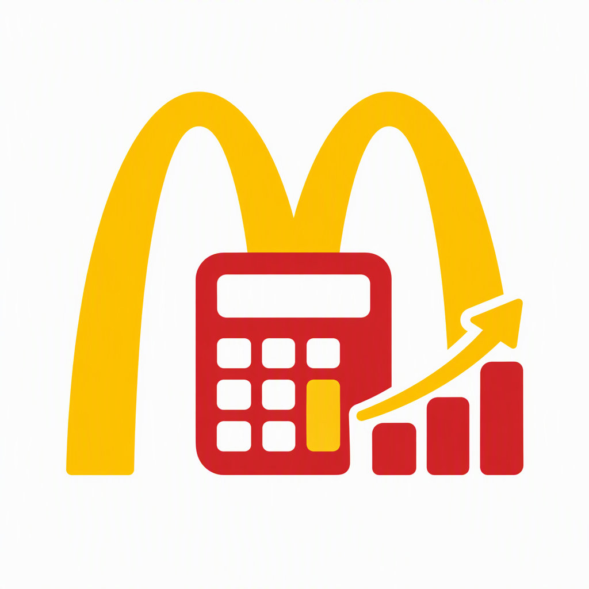

<p align="center">
  
</p>

<h1 align="center">麦麦精算师 (McActuary)</h1>

<p align="center">
  你的麦当劳资产管理顾问 — 一键领券省钱 + 积分投资决策 + 跨模块最优方案推荐
</p>

<p align="center">
  <a href="https://open.mcd.cn/mcp"></a>
  <a href="https://www.workbuddy.cn"></a>
  <a href="LICENSE"></a>
</p>

<p align="center">
  <a href="https://github.com/399065680-cmd/mcd-actuary"><strong>GitHub</strong></a> ·
  <a href="https://github.com/M-China/mcd-developer-innovation-challenge"><strong>比赛仓库</strong></a> ·
  <a href="demo/index.html"><strong>🎮 在线 Demo</strong></a>
</p>

---

## ✨ 项目简介

「麦麦精算师」是一个基于麦当劳中国 MCP（Model Context Protocol）能力开发的 **WorkBuddy Skill**。

它把用户的麦当劳数字资产——**优惠券**（现金等价物）、**积分**（投资资本）、**抽奖机会**（高风险投资）——当作一个"投资组合"来管理。通过一个跨模块**价值决策引擎**，帮助你在"用券买 vs 积分兑换 vs 抽奖搏一搏"之间做出最优选择。

### 一句话卖点

> 不是又一个省钱工具，而是第一个把优惠券、积分、抽奖拉通做对比决策的麦当劳 AI 精算师。

### 为什么需要它？

大部分麦当劳用户只用了 MCP 能力的一小部分——要么只领券，要么只看积分。但优惠券和积分是**交叉的**：

> 你想吃一个巨无霸——
> - 用优惠券买，可能 ¥15
> - 用积分兑换，可能 0 元，但积分 3 天后过期
> - 抽奖搏一搏，消耗 500 积分
>
> **单独哪个方案都给不出最优解，麦麦精算师能。**

---

## 🎮 在线 Demo

无需配置，先感受一下 Skill 的对话效果：

👉 **[点这里体验在线 Demo](demo/index.html)**

或者手动打开仓库里的 `demo/index.html`，切换四个场景看对话模拟：

| 场景 | 展示能力 |
|------|----------|
| 一键领券 | 自动领券 + 优惠券组合优化 |
| 价值决策 | 用券 vs 积分兑换 vs 抽奖 三方案对比 |
| 积分投资 | 积分余额、性价比排行、抽奖 EV |
| 月度报告 | 消费、省钱、积分、行动建议 |

---

## 🚀 核心功能

### 模块一：省钱模块
- 一键领取所有可用优惠券
- 查询附近门店 + 门店可用优惠
- 智能匹配最优优惠券组合
- 最低价下单

### 模块二：积分投资模块
- 积分账户体检（余额、过期预警）
- 商城商品积分性价比排行
- 抽奖期望值（EV）分析
- 积分兑换 / 抽奖执行

### 模块三：价值决策引擎（跨模块创新）⭐
- 同时计算"用券买""积分兑换""抽奖"三种方案
- 综合积分过期、优惠券折扣、抽奖 EV 给出最优推荐
- **本 Skill 区别于其他省钱/积分工具的核心创新点**

### 模块四：消费报告模块
- 月度消费 + 省钱明细
- 积分收益率分析
- 下一步行动建议

---

## 💬 使用示例

### 示例 1：一键领券 + 省钱下单

```
用户：帮我领券，我想吃巨无霸套餐

麦麦精算师：
已为你领取 8 张优惠券，其中 2 张将在 3 天内过期。

附近门店：麦当劳(XX路店) - 距离 800m

巨无霸套餐最优方案：
  原价：¥39
  使用优惠券：巨无霸套餐立减10元券
  实付：¥29，省 ¥10

确认下单？
```

### 示例 2：跨模块价值决策（核心场景）

```
用户：我想吃巨无霸，怎么最划算？

麦麦精算师：
为你找到 3 种方案：

方案A（推荐）：积分兑换
  巨无霸兑换券 — 需 2000 积分
  你的积分余额：3500，其中 500 积分 3 天后过期
  积分性价比：★★★★☆

方案B：优惠券购买
  巨无霸套餐 — 原价 ¥39 → 用券后 ¥25，省 ¥14

方案C：抽奖
  消耗 500 积分/次，EV = ¥1.2（不划算）

建议：选择方案A，积分即将过期，兑换最划算。
```

### 示例 3：月度报告

```
用户：帮我看看这个月消费报告

麦麦精算师：
=== 麦麦精算师 月度报告 ===

本月消费：6 单，总计 ¥186
优惠券节省：¥52（使用 4 张券）
积分变动：+820 获取，-2000 兑换，余额 1500
即将过期：300 积分（5 天后）

行动建议：
1. 有 2 张优惠券即将过期，建议本周使用
2. 积分余额偏低，近期消费可累积
3. 当前抽奖 EV 为负，不建议抽奖
```

---

## 🛠 安装

### 前置条件

1. 申请麦当劳 MCP Token：访问 https://open.mcd.cn/mcp
2. 安装 WorkBuddy：访问 https://www.workbuddy.cn

### 配置步骤

1. **配置麦当劳 MCP 连接器**

   打开 WorkBuddy -> 侧边栏「连接器」-> 右上角「自定义连接器」->「配置 MCP」

   填入以下 JSON（替换 `YOUR_MCP_TOKEN` 为你的实际 Token）：

   ```json
   {
     "mcpServers": {
       "mcd-mcp": {
         "type": "streamablehttp",
         "url": "https://mcp.mcd.cn",
         "headers": {
           "Authorization": "Bearer YOUR_MCP_TOKEN"
         }
       }
     }
   }
   ```

   点击「保存」，回到「自定义连接器」将 mcd-mcp「启用」。

2. **安装本 Skill**

   将本仓库的 `SKILL.md` 文件放入 WorkBuddy 用户级 Skills 目录：

   ```bash
   cp SKILL.md ~/.workbuddy-ai/skills/mcd-actuary/SKILL.md
   ```

   或在 WorkBuddy 中通过 Skill 管理界面导入。

3. **开始使用**

   在 WorkBuddy 对话框中直接输入需求即可，例如：
   - "帮我一键领券"
   - "我想吃巨无霸，怎么最划算"
   - "我的积分还有多少"

---

## 🧠 技术架构

```
用户对话
   |
   v
WorkBuddy AI (Skill 引擎)
   |
   +---> 省钱模块 (13 个 MCP Tools)
   +---> 积分投资模块 (9 个 MCP Tools)
   +---> 价值决策引擎 (跨模块编排)
   +---> 消费报告模块 (5 个 MCP Tools)
   +---> 营养信息辅助 (1 个 MCP Tool)
   |
   v
麦当劳 MCP Server (https://mcp.mcd.cn)
```

共使用 **18 个** 麦当劳 MCP 工具，覆盖 33 个可用工具的 **55%**。

详细 MCP 工具调用流程见 [MCP_INTEGRATION.md](MCP_INTEGRATION.md)。

### 辅助算法

项目包含 `src/calculator.py`，实现以下算法：

| 算法 | 说明 |
|------|------|
| 优惠券组合优化器 | 遍历优惠券子集，调用 `calculate-price` 找最低总价 |
| 抽奖期望值计算器 | EV = Σ(奖品价值 × 中奖概率) − 抽奖成本 |
| 积分性价比排行器 | 按 value/point 排序，标注星级 |
| 跨模块决策引擎 | 积分过期优先 → 优惠券折扣 → 抽奖 EV 的规则链 |

---

## 📁 项目结构

```
mcd-actuary/
├── images/
│   └── logo.png             # 项目 Logo
├── demo/
│   └── index.html            # 在线 Demo（交互式对话模拟）
├── src/
│   └── calculator.py         # 辅助算法实现
├── SKILL.md                  # 核心 Skill 定义（WorkBuddy 指令文件 = 源代码）
├── README.md                 # 项目说明（本文件）
├── CONTEST_DECLARATION.md    # 参赛声明
├── MCP_INTEGRATION.md        # MCP 工具集成文档
├── mcp-config.example.json   # 脱敏 MCP 配置示例
├── workbuddy.md              # WorkBuddy 开发对话上下文
├── promo-copy.md             # 推广文案模板
└── LICENSE                   # MIT
```

---

## 🎯 目标用户

- 麦当劳高频消费者（每周 2 次以上）
- 关注积分和优惠券价值最大化的人群
- 想用 AI 简化点餐决策的程序员和上班族
- 对"薅羊毛"有执念的价格敏感型用户

---

## 📣 竞赛信息

本项目为「麦当劳程序员节创意开发大赛」参赛作品。

| 项目 | 链接 |
|------|------|
| 比赛仓库 | https://github.com/M-China/mcd-developer-innovation-challenge |
| MCP Server 文档 | https://github.com/M-China/mcd-mcp-server |
| 开发工具 | WorkBuddy |

如果你也觉得这个项目有意思，欢迎 **Star** ⭐ 支持！排名全靠 GitHub Star 数，你的每一个 Star 都直接影响比赛成绩。

---

## 🙏 支持

如果这个 Skill 帮你省了钱或者帮你理清了积分该怎么花，就给它一个 Star 吧！

[](https://github.com/399065680-cmd/mcd-actuary)

---

## ⚠️ 声明

本项目由参赛者独立开发，非麦当劳官方产品。项目输出仅供参考，餐品信息、价格及供应状态以麦当劳官方渠道的实时结果为准。MCP Token 请妥善保管，配置文件中仅使用环境变量占位符。

## License

MIT
